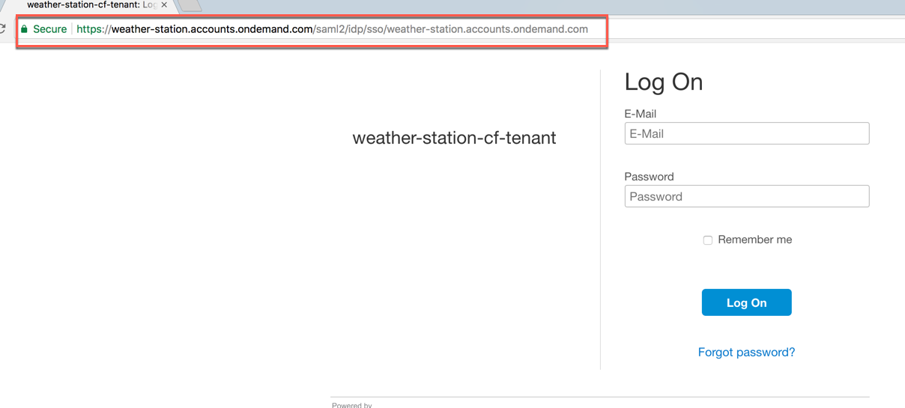
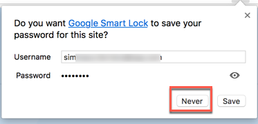
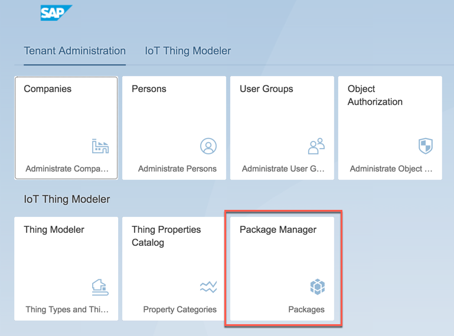
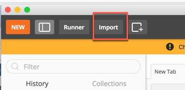
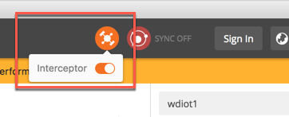
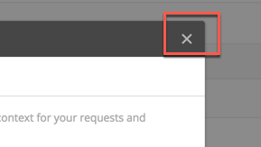

<table width=100% border=>
<tr><td colspan=2><h1>EXERCISE 04 - IoT Application Enablement</h1></td></tr>
<tr><td><h3>SAP Partner Workshop</h3></td><td><h1> &nbsp;30 min</h1></td></tr>
</table>

## Description
This document provides you with

## Target group

* Developers
* People interested in SAP Leonardo and Machine Learning 

## Goal

The goal of this exercise is

## Prerequisites
  
Here below are prerequisites for this exercise.

* An SAP IOT Service system. It will be provided by your instructor
* A remote desktop connection app to access the remote system

## Steps

1. [Create your own Package for Greenhouses](#create-package)
1. [Create the Thing Model](#thing-model)
1. [Setting up Postman to call APIs](#postman)
1. [Create a Thing](#create-thing)
1. [Build an App with WebIDE template](#build-app)

###  Create your own Package for Greenhouses
	
1. Open your browser and navigate to the URL <https://iotae-weather-station.iot-sap.cfapps.eu10.hana.ondemand.com/launchpage/#Shell-home>. Logon using the credentials provided by your instructor. Do not thick the **Remember me** checkbox  
	

1. Do not save the password in your browser  
	

1. A launchpad opens up: click on the Package Manager tile  
	

1. Click on the "**+**" sign to create a new package  
	

1. Enter

	| Parameter | Value|
	| --- | --- |
	| Name| pw.greenhouse.XX |
	| Description | Power week greenhouse XX |
	| Scope | Private |
	
	where **XX** must be replaced by your group number. Then click first on **Save** and then on the **Home** button  
	

###  Create the Thing Model

1. From the Weather Station Tenant Launchpad click on the **Thing Properties Catalog** tile  
	

1. Click on the "cube" button to change package  
	

1. Search for "pw.greenhouse" and you should be able to find your package pw.greenhouse.xx where xx must be replace with your group number. Click on your package name  
	

1. Once you have selected your package and you have verified that it's the correct one, click on the "**+**" symbol in the master view. This will allow you to create a new property set  
	

1. Enter "**pw\_status\_capability\_xx**" as the Name (remember to replace **xx** with your group number) and select **Measured Values** ad Category. Then click **Save**  
	

1. A new property set has been added. Keeping it selected, click on the "**+**" sign in the Measured Values section  
	

1. Enter the following values and click **OK**

	| Parameter | Value|
	| --- | --- |
	| Name| temperature |
	| Unit of Measure | °C |
	| Type | Integer |
	| Thresholds | - select all options - |
	

1. You should get a new line in the Measured Values table. Click again on the "**+**" sign to add a couple of other features  
	

1. Add the humidity with these parameters and click **OK**

	| Parameter | Value|
	| --- | --- |
	| Name| humidity |
	| Unit of Measure | % |
	| Type | Integer |
	| Thresholds | - select all options - |
	
	
1. Add the light with these parameters and click **OK**

	| Parameter | Value|
	| --- | --- |
	| Name| light |
	| Unit of Measure | CD |
	| Type | Integer |
	| Thresholds | - select all options - |
	
	
1. At the end you should have the following situation: click on the Save button and you should receive a message "Property set was saved"  
	

1. Click on the **Thing Modeler** button  
	
	
1. Make sure you are on the right package, "pw.greenhouse.xx" where xx is your group number, and click on the "**+**" sign in the master view  
	

1. Enter

	| Parameter | Value|
	| --- | --- |
	| Name| pw\_greenhouse\_xx |
	| Description | Power week greenhouse thing type xx |

	where **xx** must be replaced with your group number, and click **Save**  
	

1. Select the **Measured Values** tab and click on the "**+**" to add a new Property Set to this Thing Type  
	

1. Locate the property set you have defined earlier, select it with the checkbox and click on **OK**  
	

1. All the propeties youpreviously defined are automatically added  
	

1. Take an image for your greenhouse by searching it on the web or by right clicking on this [greenhouse.jpg](files/greenhouse.jpg) link and saving the image on your machine

1. Click on the **Image** tab and press "**+**" to add a new aimage  
	

1. Add the image you have downloaded and **Save** the package  
	

###  Setting up Postman to call APIs
In order to perform this step you need to have Postman Interceptor installed in your Chrome browser. You should have already installed it if you have followed the prerequisites to this execises series. However, for your comfort, we are adding here the required steps to do it: so if you have not done it yet, do it right now. 

1. Open Chrome and navigate to <https://chrome.google.com/webstore/search/postman%20interceptor> and select the **Postman Interceptor** tool
	

1. Click on **ADD TO CHROME**
	

1. Download the zip file [postman\_json_files.zip](files/postman_json_files.zip) and extract it in a proper location on your machine

1.	Open Postman from <chrome://apps/>
	

1.	Click on **Import** 
	

1.	Import the two json files you have extracted from the *postman\_json_files.zip* file
	
	 
1. You should receive a couple of confirmation messages that the import was successful
	

1.	Select the **wdiot1** environment on the upper right corner, press the **Eye** icon, and click on **Edit**	 
	

1.	Change the

	| Parameter | Value|
	| --- | --- |
	| number| xx |
	| packageId | pw.greenhouse.xx (this is the name you used earlier)|
	 
	where **xx** must be replaced with your group number. Then click on **Update**	 
	
1. Close the popup window from the top right corner
	
	
1. Make sure that the **Postman Interceptor** is enabled
	

1.	On the left-hand side, select **01 Thing Configuration -> Read configuration**. A new tab opens up on the right-hand side containing a GET request to read the package configuration. Some of the variables in the URL request will be replaced by the corresponding ones in the environment you have configured before. Click on **Send**
	

1. You shoudl get a JSON file with all the details about your package configuration
	

1. If the response you get is only an HTML file, it means that there is something wrong. Please check that your Postman Interceptor is enabled and try by signing in again to the Weather Station on Chrome with your credentials
	

	 

###  Create a Thing
In this section you are going to learn how to create a Thing using the SAP IoT AE UI. The Thing is based on the Thing Type you created earlier. Then you will learn how to use the Thing Modeler to create thresholds for temperature and finally how to update the location of the Thing with Postman.
This step is required to give this thing a location so it can show up on a map in the UI correctly.

1. Navigate back to the SAP IoT AE UI and click on the **Thing Modeler** tile on the Tenant Administration page
	

1. Click on the cube icon in the master view to change the package 
	

1. Find your package **pw.greenhouse.xx**, where **xx** is your group number, and select it 
	

1. On the top right corner, click on **New Thing**
	

1. Enter

	| Parameter | Value |
	| --------- | ----- |
	| Name | pw\_greenhouse\_t1 |
	| Description | Power week greenhouse thing 1 |
	| Authorization Group | the one starting with "6b569" |
	| Provide | None |
	
	then click on **Save**
	>NOTE: Set first the **Provider** field to **None** so that all other unnecessary fields will go away.
	
	

1. You will get a popup window informing you that a new thing has been created. Please note down in a text editor the **Thing ID**, because it will be required later. Click on **OK**
	

1. Switch to the **Measured Values** tab, expand the temperature property and enter [1,10,30,45] for the 4 thresholds values. Then click **Save**
	

1. From Chrome, open Postman
	

1. In the "**wdiot1 iotae apis**" collection, click on **Thing Onboarding -> Fetch csrf token**. Click **Send** and you should receive a "**200 OK**" status code with some JSON in the response body
	

1. On the top right corner, be sure to have the **wdiot1** environment selected, click on the **eye** button and then on **Edit**
	

1. Replace the field **yourthingId** with the **Thing ID** you received when you created the thing. Make sure that a **x-csrf-token** has been created and click on **Update**
	

1. Close the popup window
	

1. Now that we have set the Thing ID in our environment and that we have get a valid x-csrf-token, we are ready to create a location for that thing. In the same collection, click on **Thing Onboarding -> Create Location**. Switch to the **body** tab and take a look to the location you are going to create. If you want, you can change those data, but for the scope of this exercise you can leave ase they are. Then click on **Send**
	

1. The location is created. You should receive a "**201 Created**" message. Note down the location ID you received in the headers
	

1. Go to the **Thing Onboarding -> Read the created thing**, click on **Send** and copy in the clipboard the entire response body. In this way we are copying the Thing's metadata, we will use this in the next step
	

1. Go to the **Thing Onboarding -> Update Thing (incl. location)**, delete the current **body** content and paste the one you have in memory, copied in the previous step
	

1. Add the line `"_location":"<location_ID>",` where \<location\_ID\> must be replaced by the location ID you got in the headers when you created the location, just above the "_objectGroup" property. Then click **Send** and check that you have received a "**201 Created**" message
	

1. Go to the **Thing Onboarding -> Read the created thing**, click on **Send** and check that the thing has been updates with the new _location property.
	

-- UNFINISHED ---
###  Build an App with WebIDE template
In this exercise you will build a simple app to allow you to monitor all air quality sensors and drill down to your specific one and examine and learn about the data it generates.

https://webidecp-aae9c2f7b.dispatcher.hana.ondemand.com/

air_q_mon_xx
com.sap.airqmonxx
Air quality monitor XX

## Summary
You have completed the exercise!
 
You are now able to: 

* use IOT Gateway Edge provisioning with MQTT protocol
* automatic onboard device and sensor with Gateway Edge using MQTT protocol
* send Data with PAHO MQTT Client
* consume data via IOT Services Cockpit and APIs

Please proceed with next exercise.
