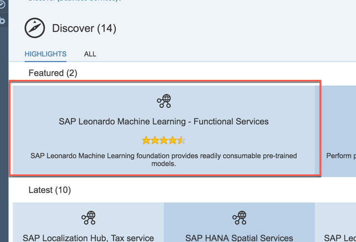
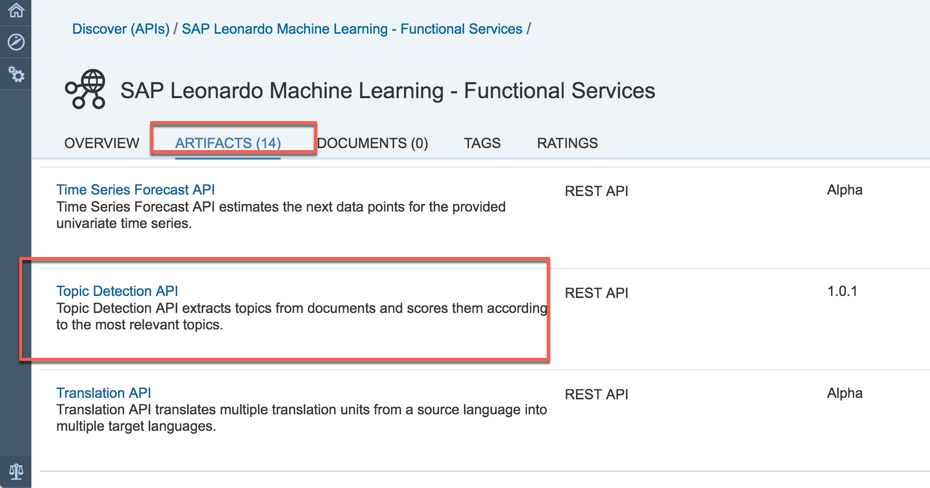
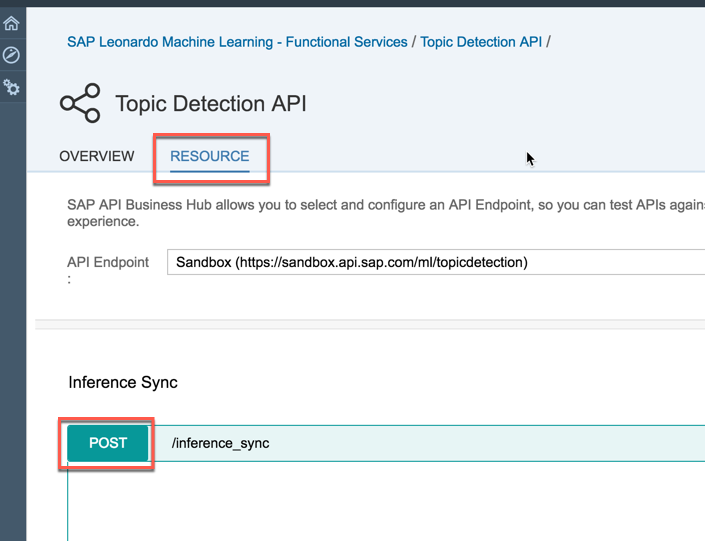
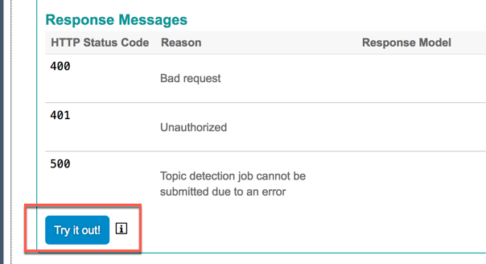

<table width=100% border=>
<tr><td colspan=2><h1>EXERCISE 05 - ML APIs Exploration</h1></td></tr>
<tr><td><h3>SAP Partner Workshop</h3></td><td><h1> &nbsp;20 min</h1></td></tr>
</table>


## Description
In this exercise, you’ll learn how 

* to import a project into SAP Web IDE Full-Stack

## Target group

* Developers
* People interested in SAP Leonardo and Machine Learning 


## Goal

The goal of this exercise is to import an already preconfigured project in SAP Web IDE Full-Stack, which will be used in the next exercises.


## Prerequisites
  
Here below are prerequisites for this exercise.

* A trial account on the SAP Cloud Platform. You can get one by registering here <https://account.hanatrial.ondemand.com>
* Download the following file from here [MLFSAPUI5\_Project\_Exercise.zip](files/MLFSAPUI5_Project_Exercise.zip) and save it in a proper location: it will be used later in this document


## Steps

1. [Use SAP Leonardo ML Topic Detection on API Business Hub](#topic-detection)
1. [Use SAP Leonardo ML Image Classification on API Business Hub](#image-classification)

 

### <a name="topic-detection"></a> Use SAP Leonardo ML Topic Detection on API Business Hub
1. Open SAP Business Hub in your browser <https://api.sap.com>
	

	>NOTE: Please use Firefox to avoid the SSO login [for SAP Employees only].

1. 	Choose **Business Services**  
	
1. Choose **SAP Leonardo ML - Functional Services**  
	
1. Choose **ARTIFACTS** and select **Topic Detection API**. Currently there are 14 functional services listed
	
1. We need to login to test the service: click on the **Login** button at the top right corner  
	
1. Enter your user-id (here: ml-train+XX@sap.com) and click **Log On**
	
1. Under **RESOURCE**, open the **POST** service.
	
1. Scroll down to the **PARAMETERS** and under **options**, paste the following parameters
	
	```json
	{"numTopics":3, "numTopicsPerDoc":2, "numKeywordsPerTopic":15}
	```	
	
to 3 and the numTopicsPerDoc to 2
1. Under **files** press the **Browse** button
	
1. Choose the *Topic_Detection.zip* file (you have already downloaded it in the prerequisites section) containing text files about computer science and pies  
	
1. The name of the selected file appears aside the **Browse** button
	
1. Scroll down to the **Try it out!** button and start the API call by clicking on it
	
1. Validate the result in the Response Body. The response contains keywords for all submitted files in the zip file

	```json
	 {
  "_id": "7240a03c-5bca-4935-a9fa-fe9f5681a763",
  "processed_time": "Fri, 09 Feb 2018 08:47:27 GMT",
  "request": {
    "files": [
      "Topic_Detection_1.zip"
    ],
    "options": {
      "numKeywordsPerTopic": 15,
      "numTopics": 3,
      "numTopicsPerDoc": 2
    },
    "tenantName": "imgclassif-tech-user",
    "texts": []
  },
  "status": "DONE",
  "tenantName": "imgclassif-tech-user",
  "topicDetection": [
    {
      "docName": "computer-science.txt",
      "keywords": [
        [
          "computer",
          "computation",
          "service",
          "study",
          "field",
          "theory",
          "computational",
          "generation",
          "serviceoriented",
          "program",
          "science",
          "hardware",
          "practical",
          "challenge",
          "language"
        ],
        [
          "business",
          "company",
          "legal",
          "good",
          "economic",
          "old",
          "english",
          "sense",
          "word",
          "service",
          "sector",
          "occupation",
          "market",
          "person",
          "social"
        ]
      ],
      "scores": [
        0.8782829994488971,
        0
      ],
      "topics": [
        1,
        2
      ]
    },
    {
      "docName": "apple-pie.txt",
      "keywords": [
        [
          "pie",
          "dough",
          "pastry",
          "fill",
          "apple",
          "baking",
          "minute",
          "dish",
          "top",
          "add",
          "bowl",
          "butter",
          "serve",
          "bottom",
          "sugar"
        ],
        [
          "business",
          "company",
          "legal",
          "good",
          "economic",
          "old",
          "english",
          "sense",
          "word",
          "service",
          "sector",
          "occupation",
          "market",
          "person",
          "social"
        ]
      ],
      "scores": [
        0.7418351885711766,
        0
      ],
      "topics": [
        0,
        2
      ]
    },
    {
      "docName": "business.txt",
      "keywords": [
        [
          "business",
          "company",
          "legal",
          "good",
          "economic",
          "old",
          "english",
          "sense",
          "word",
          "service",
          "sector",
          "occupation",
          "market",
          "person",
          "social"
        ],
        [
          "computer",
          "computation",
          "service",
          "study",
          "field",
          "theory",
          "computational",
          "generation",
          "serviceoriented",
          "program",
          "science",
          "hardware",
          "practical",
          "challenge",
          "language"
        ]
      ],
      "scores": [
        1.0927966662298407,
        0
      ],
      "topics": [
        2,
        1
      ]
    },
    {
      "docName": "pie.txt",
      "keywords": [
        [
          "pie",
          "dough",
          "pastry",
          "fill",
          "apple",
          "baking",
          "minute",
          "dish",
          "top",
          "add",
          "bowl",
          "butter",
          "serve",
          "bottom",
          "sugar"
        ],
        [
          "computer",
          "computation",
          "service",
          "study",
          "field",
          "theory",
          "computational",
          "generation",
          "serviceoriented",
          "program",
          "science",
          "hardware",
          "practical",
          "challenge",
          "language"
        ]
      ],
      "scores": [
        0.741830473544088,
        0.0030095517794513685
      ],
      "topics": [
        0,
        1
      ]
    }
  ]
}

	```
1. Test is again with changed options. Therefore change the values for **numTopics** to **2** and **numTopicsPerDocs** to **1**. Try it out! What has changed?  
	

	```json
	{
  "_id": "e892d526-4b92-4fa3-98c4-3e087be6f91d",
  "processed_time": "Fri, 09 Feb 2018 08:53:57 GMT",
  "request": {
    "files": [
      "Topic_Detection_1.zip"
    ],
    "options": {
      "numKeywordsPerTopic": 15,
      "numTopics": 2,
      "numTopicsPerDoc": 1
    },
    "tenantName": "imgclassif-tech-user",
    "texts": []
  },
  "status": "DONE",
  "tenantName": "imgclassif-tech-user",
  "topicDetection": [
    {
      "docName": "computer-science.txt",
      "keywords": [
        [
          "computer",
          "service",
          "business",
          "company",
          "field",
          "study",
          "theory",
          "computation",
          "good",
          "legal",
          "old",
          "word",
          "sense",
          "english",
          "economic"
        ]
      ],
      "scores": [
        0.7163535868960575
      ],
      "topics": [
        1
      ]
    },
    {
      "docName": "apple-pie.txt",
      "keywords": [
        [
          "pie",
          "dough",
          "pastry",
          "fill",
          "apple",
          "baking",
          "minute",
          "dish",
          "top",
          "add",
          "bowl",
          "butter",
          "serve",
          "bottom",
          "sugar"
        ]
      ],
      "scores": [
        0.7420058746055054
      ],
      "topics": [
        0
      ]
    },
    {
      "docName": "business.txt",
      "keywords": [
        [
          "computer",
          "service",
          "business",
          "company",
          "field",
          "study",
          "theory",
          "computation",
          "good",
          "legal",
          "old",
          "word",
          "sense",
          "english",
          "economic"
        ]
      ],
      "scores": [
        0.7161560026832259
      ],
      "topics": [
        1
      ]
    },
    {
      "docName": "pie.txt",
      "keywords": [
        [
          "pie",
          "dough",
          "pastry",
          "fill",
          "apple",
          "baking",
          "minute",
          "dish",
          "top",
          "add",
          "bowl",
          "butter",
          "serve",
          "bottom",
          "sugar"
        ]
      ],
      "scores": [
        0.7418664400367381
      ],
      "topics": [
        0
      ]
    }
  ]
}
	```
1. You have completed the exercise! You have successfully used the Topic Detection API service to find **numKeywordsPerTopic** keywords and **numTopics** topics across all documents. The topics get a number, starting with 0. So, if you define 3 Topics, they will be numbered with 0, 1, 2. With **numTopicsPerDoc** you define how many of the topics of the entire document corpus can be found in one document. The algorithm chooses the number of topics which fits best and assigns them a score which is not normalized to 1.  


### <a name="image-classification"></a> Use SAP Leonardo ML Image Classification on API Business Hub


-- to be done --


## Summary
This concludes the exercise. You should have learned how to import a preexisting project in SAP Web IDE Full-Stack.

You are now able to:

* Browse through API Business Hub to find the latest functional and business services of SAP Leonardo ML foundation
* Test SAP Leonardo ML foundation services directly on API Business Hub
* Understand the Topic Detection Model.

Please proceed with next exercise.