<table width=100% border=>
<tr><td colspan=2><h1>EXERCISE 05 - ML APIs Exploration</h1></td></tr>
<tr><td><h3>SAP Partner Workshop</h3></td><td><h1> &nbsp;20 min</h1></td></tr>
</table>


## Description
In this exercise, you’ll learn how 

* to consume pretrained SAP Leonardo Machine Learning services from SAP API Business Hub sandbox in a SAPUI5 application

## Target group

* Developers
* People interested in SAP Leonardo and Machine Learning 


## Goal

In this exercise you can experience how easy it is to use the available SAP Leonardo Machine Learning foundation services on SAP API Business Hub. The models are already pre-trained and can be tried out on the web page.


## Prerequisites
  
Here below are prerequisites for this exercise.

* A trial account on the SAP Cloud Platform. You can get one by registering here <https://account.hanatrial.ondemand.com>
* Download the files [Topic_Detection.zip](files/Topic_Detection.zip) and [test_images.zip](files/test_images.zip)
and save them in a proper location: they will be used later in this document


## Steps

1. [Use SAP Leonardo ML Topic Detection on API Business Hub](#topic-detection)
1. [Use SAP Leonardo ML Image Classification on API Business Hub](#image-classification)

 

### <a name="topic-detection"></a> Use SAP Leonardo ML Topic Detection on API Business Hub
1. Open SAP Business Hub in your browser <https://api.sap.com>
	

	>NOTE: Please use Firefox to avoid the SSO login [for SAP Employees only].

1. 	Choose **Business Services**  
	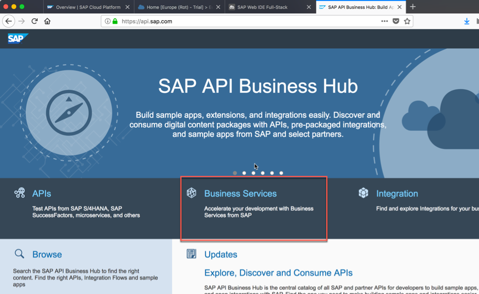

1. Choose **SAP Leonardo ML - Functional Services**  
	

1. Choose **ARTIFACTS** and select **Topic Detection API**. Currently there are 14 functional services listed
	

1. We need to login to test the service: click on the **Login** button at the top right corner  
	

1. Enter your user-id (here: ml-train+XX@sap.com) and click **Log On**
	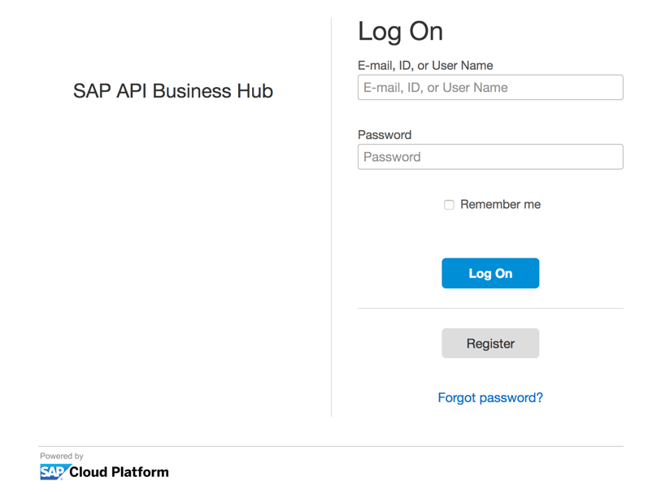

1. Under **RESOURCE**, open the **POST** service.
	

1. Scroll down to the **PARAMETERS** and under **options**, paste the following parameters
	
	```json
	{"numTopics":3, "numTopicsPerDoc":2, "numKeywordsPerTopic":15}
	```	
	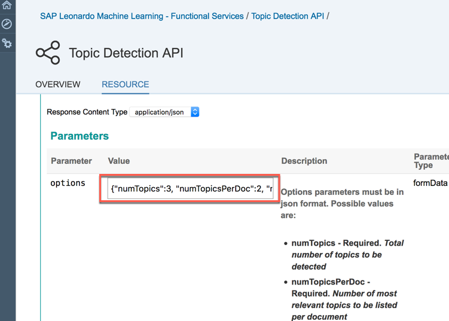

1. Under **files** press the **Browse** button
	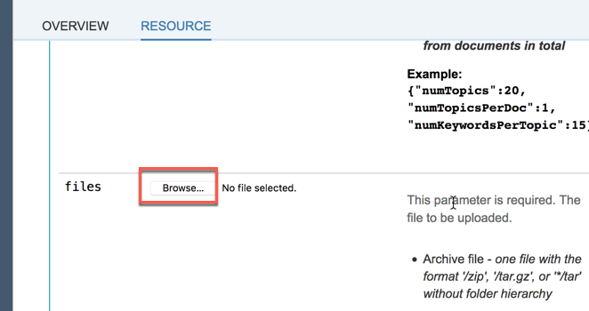

1. Choose the *Topic_Detection.zip* file (you have already downloaded it in the prerequisites section) containing text files about computer science and pies  
	

1. The name of the selected file appears aside the **Browse** button
	

1. Click on  **Try it out!** button
	

1. You should receive a **Response Code** of **200**. Check the result in the **Response Body**: you should see a content like this
	

1. Try again by changing the values for **numTopics** to **2** and **numTopicsPerDocs** to **1**  
	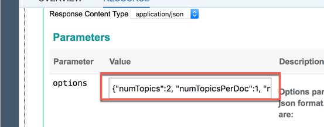

1. What has changed? You should receive an answer similar to this
	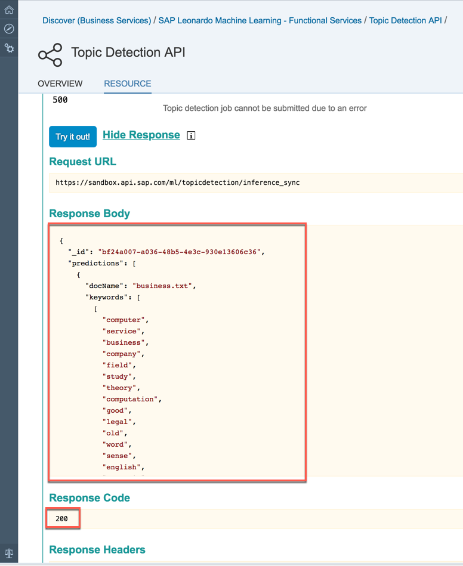

1. You have completed the exercise! You have successfully used the Topic Detection API service to find **numKeywordsPerTopic** keywords and **numTopics** topics across all documents. The topics get a number, starting with 0. So, if you define 3 Topics, they will be numbered with 0, 1, 2. With **numTopicsPerDoc** you define how many of the topics of the entire document corpus can be found in one document. The algorithm chooses the number of topics which fits best and assigns them a score which is not normalized to 1.  


### <a name="image-classification"></a> Use SAP Leonardo ML Image Classification on API Business Hub

1. Go back to <https://api.sap.com/shell/discover/contentpackage/SAPLeonardoMLFunctionalServices> and click again on the **Artifacts** tab
	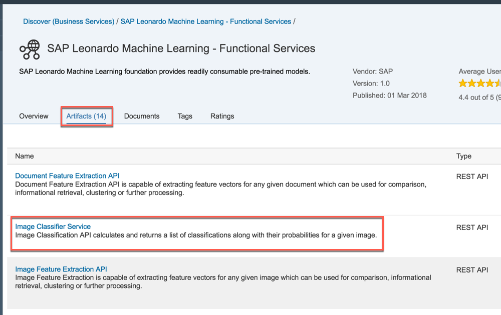

1. Expand the POST request "**/inference_sync**"
	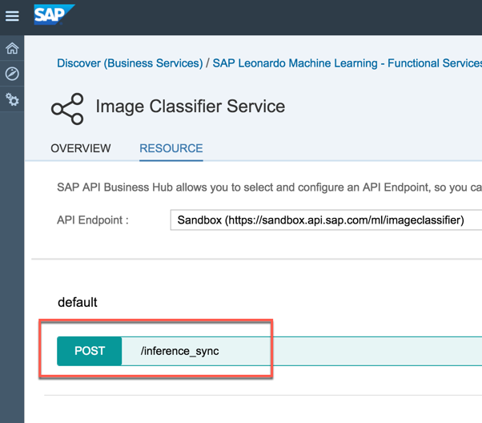

1. Click on the **Browse...** button for the **files** parameter
	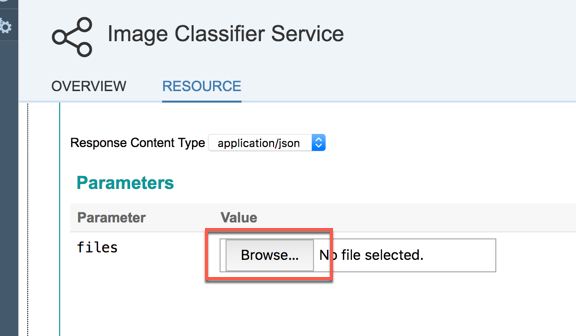

1. Select one of the images you have in the folder where you have extracted the test_images.zip file given in the prerequisites. For example choose the *tennis_ball.jpg* file. then click on the **Try it out!** button
	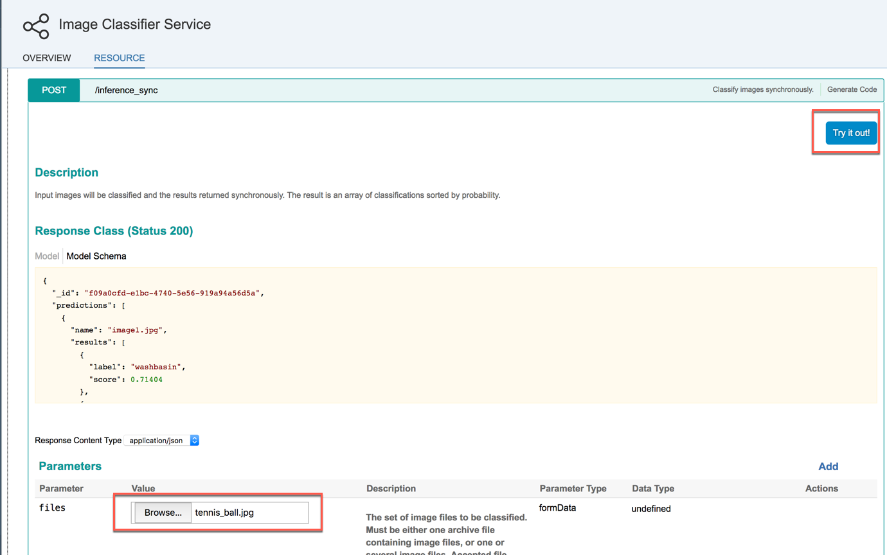

1. Look at the response code: it should be 200, meaning that the request was successful. Then look at the response body: you should be able to read the predictions against the image you uploaded with their scores
	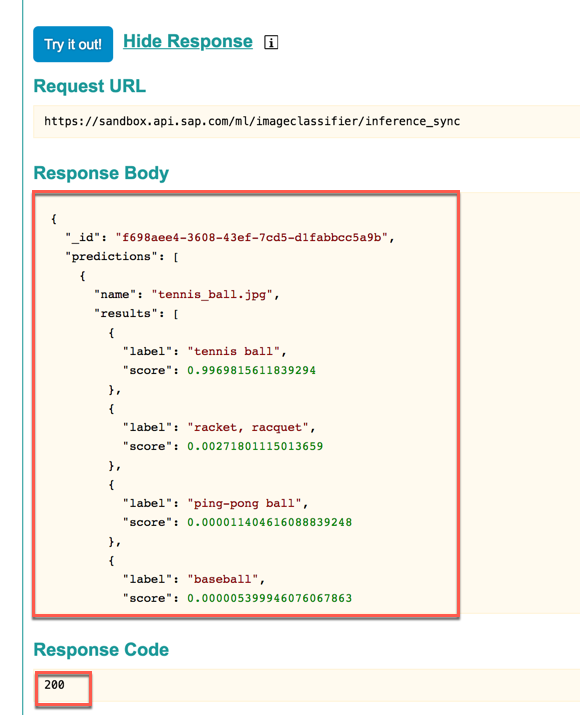

1. Congratulations! You have completed the exercise.


## Summary
This concludes the exercise. You should have learned how to import a preexisting project in SAP Web IDE Full-Stack.

You are now able to:

* Browse through API Business Hub to find the latest functional and business services of SAP Leonardo ML foundation
* Test SAP Leonardo ML foundation services directly on API Business Hub
* Understand the Topic Detection Model.

Please proceed with next exercise.
