<table width="100%" border=>
<tr><td colspan=2><h1>EXERCISE 09 - Bring your own model</h1></td></tr>
<tr><td><h3>SAP Partner Workshop</h3></td><td><h1> &nbsp;30 min</h1></td></tr>
</table>


## Description
In this exercise you get to experience how easy it is to deploy your machine learning models using SAP Leonardo Machine Learning Foundation services. You will learn how to use the SAP ML Endpoints provided in your service key, that you created for your ML Foundation Service instance. 

If you have multiple models for the same application you can also upload and choose which version you wish to serve. 
>Note: you can not deploy more than one model with the same name.

Afterwards you will deploy your own Cloud Foundry Python app consuming the deployed model to perform inference queries - a so called inference app. For convenience reason we prepared a simple SAPUI5 app for you in order to test your deployed model calling the deployed inference app.


Exercise Description - SAP Leonardo ML Foundation BYOM service consumption
-	Login to SAP Cloud Platform - Cloud Foundry environment
-	Create BYOM Service Instance and Service Key (already done in previous exercise)
-	Upload model to ML Foundation Model Repository
-	Deploy your uploaded model 
-	Adjust and deploy your prepared inference app (written in Python) to your Cloud Foundry space
-	Optional: Test your app locally (a tool like Postman is needed)
-	Test your new model via prepared SAPUI5 application deployed to your Cloud Foundry space
 


## Target group

* Developers
* People interested in SAP Leonardo and Machine Learning 


## Goal

The goal of this exercise is to understand how to access SAP Cloud Foundry cockpit, how to setup the ML Foundation service and how to generate a service key for accessing it from an external application.


## Prerequisites
  
Here below are prerequisites for this exercise.

* A trial account on the SAP Cloud Platform. You can get one by registering here <https://account.hanatrial.ondemand.com>
* You must have completed previous exercises
* MLFSAPUI5\_Project\_Exercises.zip (already imported in SAP Web IDE Full-Stack)
* The [mnist.zip](files/mnist.zip)
* A folder with the unzipped inference app [inference_app.zip](files/inference_app.zip)
* A folder with the unzipped test image files [test_images.zip](files/test_images.zip)

|Parameter   |Value                                                |
|------------|-----------------------------------------------------|
|Username    |ml-train+XX@sap.com                                  |
|Password    |\<specific to your username\> provided by the trainer|
|API endpoint|api.cf.eu10.hana.ondemand.com                        |
|Organization|ml-trainXX (same as your user name without the +)    |
|Space       |ml-trainXX (same as your user name without the +)    |
|Cloud Foundry Login command|cf login -a api.cf.eu10.hana.ondemand.com -u ml-train+XX@sap.com|

## Steps

1. [Upload and deploy your model](#upload-deploy-model)
1. [Expose your model with an API (Inference App)](#expose-model)
1. [Test your new Model](#test-model)


### <a name="upload-deploy-model"></a> Upload and deploy your model
In this section, you will take a prepared tensorflow model and upload it to the ML Foundation model repository. After uploading, you will deploy it which will take a few minutes as the docker containers are instantiated for this model.
	
1.	Navigate in the SCP Cloud Foundry Cockpit to your Service Key. Select the Model Repo URL and copy it  
	
1.	Open a new browser window and paste the copied URL. A Swagger UI is opened up  
	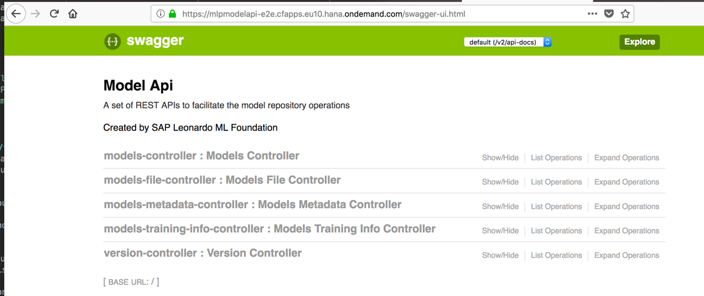

	>Note: it might change in the future	 

1.	Open the first entry **models-controller** and select the POST URL  	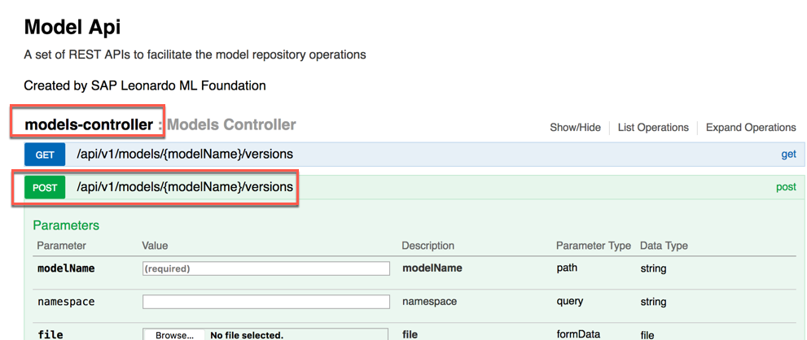
	 
1.	This UI provides the function to upload your own model. Enter the following parameters:

	|Parameter|Value|
	|---------|-----|
	| modelName| enter a name of your choice, for example **mnist\_model\_XX** where **XX** is your workstation ID|
	|File|select the [mnist.zip](files/mnist.zip) file you have downloaded in the prerequisites|
	|Authorization|enter your token generated with the Access Token tool|  

	Click on **Try it out!** to upload your model  	
	 
1. While the file is getting uploaded to the server you will get a small progress bar on the right side at the bottom of the screen  
	
1.	In the Response Body you should get an answer like the one in the screenshot where you can see that the **modelStatus** is still **INACTIVE**. We will now deploy the model to the ML Foundation model repository. Note down the **modelName** and the **version**, because you will need it in the next steps  
	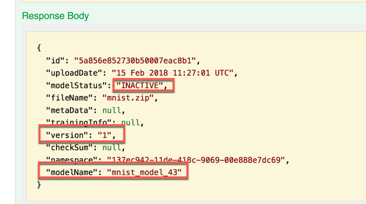
	 
1.	Navigate in the SCP Cloud Foundry Cockpit to your Service Key. Select the Deployment URL and copy it in the clipboard	 
	
1.	Open a new browser window, paste and open the copied Deployment URL. A Swagger UI is opened up  

	
	
	>Note: it might change in the future	 
	 
1.	Select the Deploy Model Controller - POST method. 
	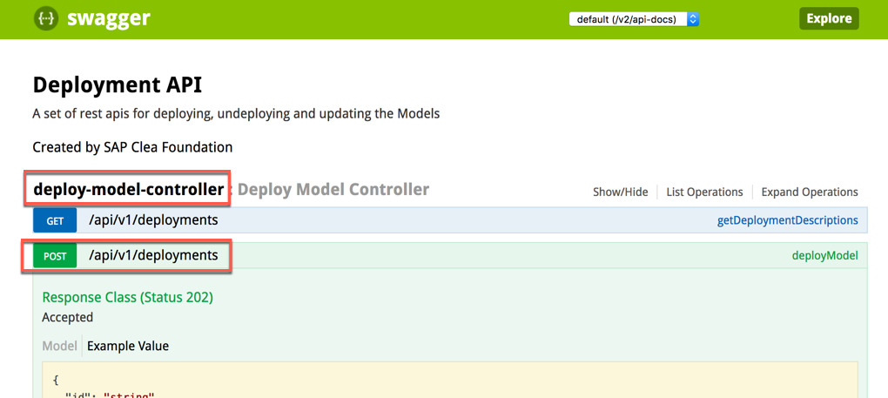

1.	This UI provides the function to deploy the model you have uploaded previously. Enter the following parameters:

	|Parameter|Value|
	|---------|-----|
	|deployModelRequest| the json script here below |
	|Authorization|enter your token generated with the Access Token tool|  

	```json
	{
	 "modelName": "<<< model_name >>", 
	 "version": "<<< version_number >>>"
	}
	```
	Click on **Try it out!** to deploy your model  	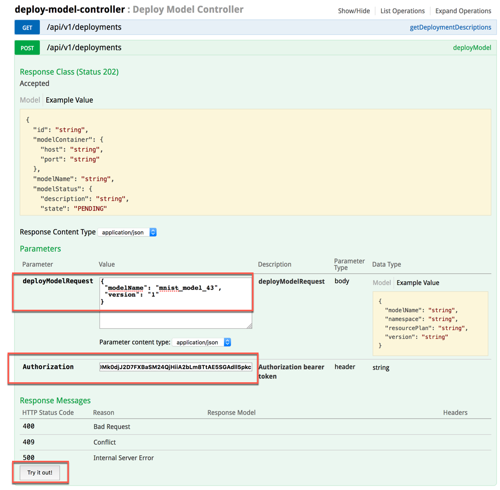


1.	You will get a Response Body similar to the one in the screenshot. The status will be **PENDING** at the beginning. 	 
	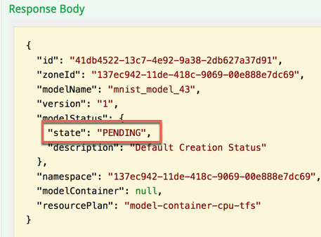

1.	Within the same Deployment API URL page, select the **GET** method. Enter the following parameters and click on the **Try it out!** button to check the deployment status

	|Parameter|Value|
	|---------|-----|
	|modelName| the name of your model |
	|Authorization|the token generated with the Access Token tool|  

	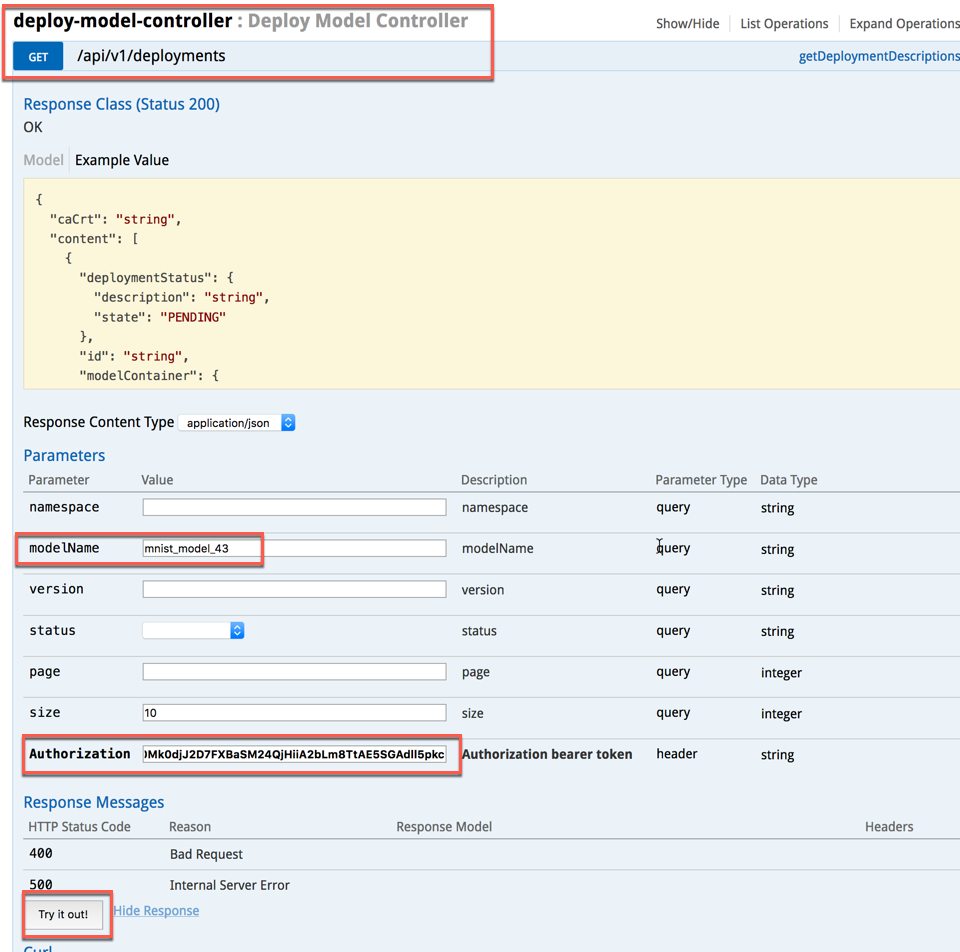

1.	Initially you might still get the **PENDING** status
	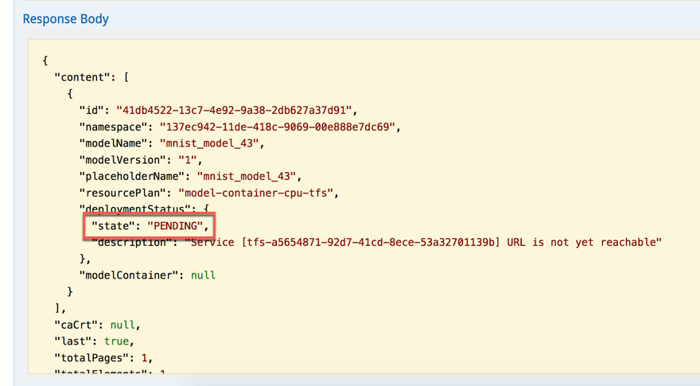
1. Please repeat that step until you get a response with the **deploymentStatus** as **SUCCEEDED**. Please keep this window open as you need some information in the next step
	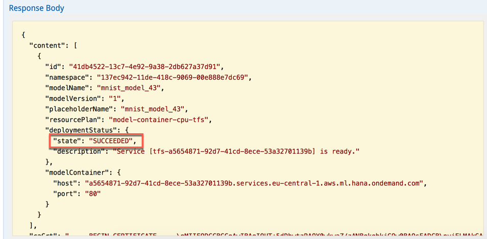


### <a name="expose-model"></a> Expose your Model with an API (Inference App)
In the next section, you will adjust a prepared inference app with your destinations and credentials. It will then be deployed to you SCP Cloud Foundry space. This step is needed to expose you model via a REST API or URL that can later be used in an application for the inference phase.

1. Download the [inference_app.zip](files/inference_app.zip) and extract it in a proper folder on your machine
	
1. Open the *manifest.yml* file with your favourite editor: it should look like this

	```yml
	---
	applications:
	- name: byom_infapp_XX
	  memory: 512M
	  timeout: 30
	  buildpack: python_buildpack
	  env:
	    MODEL_NAME: mnist_model_XX
	  services:
	    - ml_instance_XX
	```
	
	>NOTE: this is a very "sensible" file in the sense that you need to pay attention to its formatting otherwise pushin the app to Cloud Foundry won't work

1.	You need to enter the following information

	|Parameter|Value|
	|---------|-----|
	|name| the name you want to give to the Cloud Foundry application (i.e. byom\_infapp\_XX) |
	|MODEL\_NAME|the name of the model you have just deployed (i.e. mnist\_model\_XX)|  
	|services|the name of ML Foundation instance you have created in the first exercises (i.e. ml\_instance\_XX)|
	Remember to replace XX with your workstation ID. If you have followed the naming convention we have used so far, you just need to replace the XX placeolder in this file. Once done, save and close the file.

	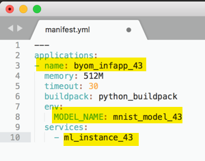

1.	In order to deploy your Python inference app to your Cloud Foundry space, open a Terminal window and go to the folder where you have extracted the inference app

1. Check that you are in the proper space by entering the commands
	
	```sh
	cf api
	cf apps
	```

	If not, you need to login again with the command 

	```sh
	cf login -a https://api.cf.eu10.hana.ondemand.com -u ml-train+XX@sap.com
	```
	where **XX** must be replaced with your workstation ID

	

1. Run the following command in this folder. The Python app is pushed to SAP Cloud Foundry according to the information specified in the *manifest.yml* file 

	```sh
	cf push
	```   
	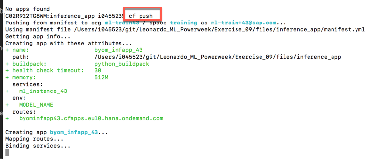

1.	At the end of the process (it might take a while), you will get a message like this where the application is shown as running. Note down the routes URL of your deployed app, since it will be required in the next section
	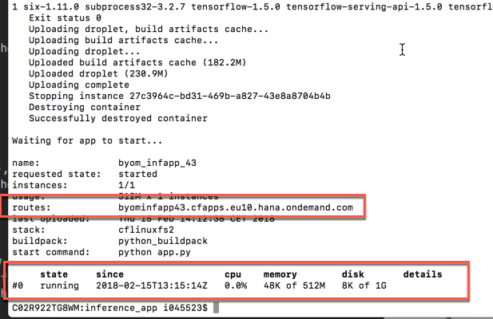


### <a name="test-model"></a> Test your new model
To test your new model. We prepared a SAPUI5 app that will point to your inference app in order to call your model for inference.

1.	Open your SAP WebIDE Full-Stack edition. Navigate to your project that you previously imported before
	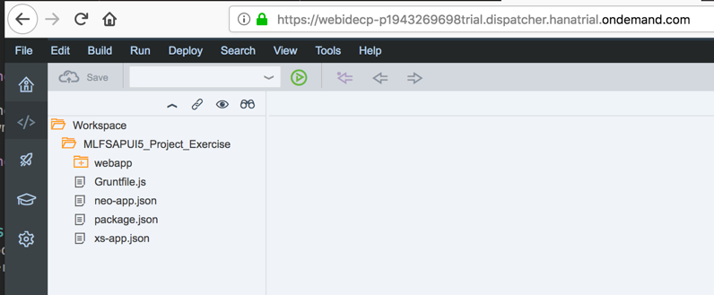
1.	Select the name of the project and execute the app by pressing the Run button on the toolbar
	

1. An application with two tiles comes up. Select the tile with the title **Bring your own Model** 
	

1.	Here you need to enter the two things: the URL of your deployed inference app as this is your exposed API endpoint and the image you want to process
	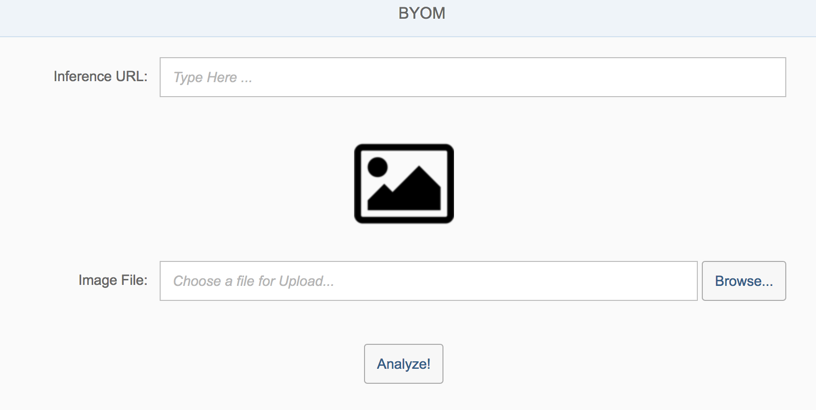
1. Copy and paste the routes URL from the terminal window into the Inference URL textbox by prefixing this URL with "https://"; thenk click **Browse**
	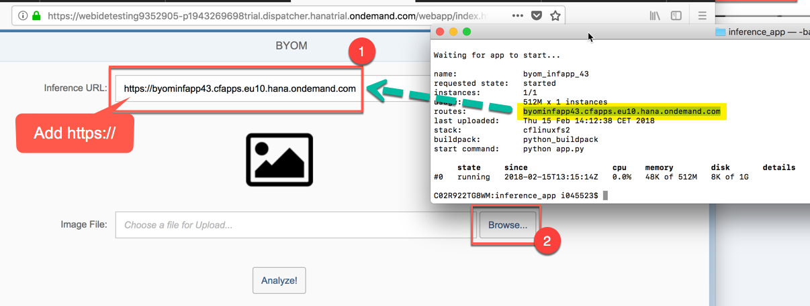
1. Select an image from the folder *test_images* folder you have already downloaded as explained in the prerequisites
	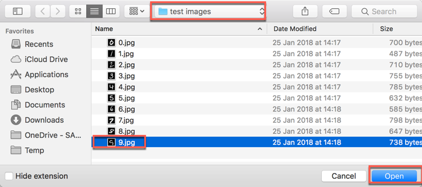

1.	Click on **Analyze!** to test your model. 
	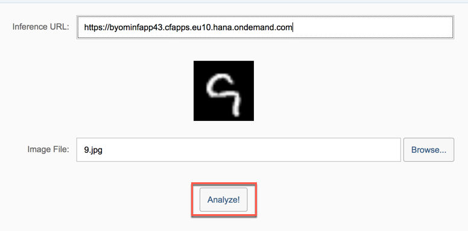

1.	You should get an output that says Result <number> as shown on the screenshot here
	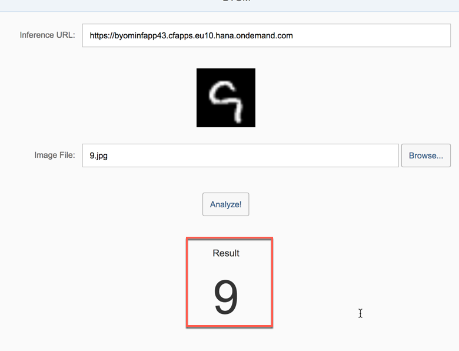


## Summary
You have completed the exercise!
 
You are now able to: 

* Use the service key to retrieve the ML Foundation API endpoints
* Upload your Model using the Model API
* Deploy your Model using the Deployment API
* Check the status of your Model Deployment
* Create and deploy an inference app (written in Python) to your Cloud Foundry space
* Test your newly deployed model using a Cloud Foundry SAPUI5 app

Please proceed with next exercise.
